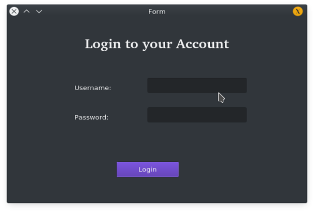
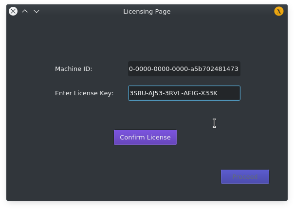

# Software-Piracy-Prevention-System

## Installation

Use the package manager [pip](https://pip.pypa.io/en/stable/) to install Piracy Prevention Solution.

```bash
pip -r install requirements.txt
```

## Usage

```bash
python3 manage.py runserver
```
## Glimpse




## Contributing
Pull requests are welcome. For major changes, please open an issue first to discuss what you would like to change.

Please make sure to update tests as appropriate.

## License
[MIT](https://choosealicense.com/licenses/mit/)
